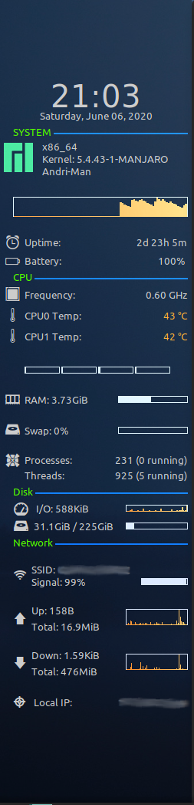

# minimal-conky
Requirements: Conky, Conky-colours, LM_Sensors

Why? 
Conky is a great tool. However the things people were doing with it were either way to simple or overly fancy.
This is just a basic template using conky-colors for system monitoring with just the things you need. 

some sensors may need to be replaced depending on your specific system. 

I have been tinkering with conky for a while, conky with conky-colors for graphs and such is quite easy to use 
so it was quite straight forward. First I had to know what sensors there are on my board. Running 'sensors-detect' lets lm_sensors detect what sensors your main board has. After that you can run 'sensors' to see what you are working with. 
I looked online for inspiration for layouts and found some that were simple enough, yet informative. So I chose the best from all of them and settled on the layout that is in the example image. 

Line 0 to 62 contain general conky settings and should be tailored to your own setup. (screen size, layout etc) You can also define things such as borders and transparency here. This is in no way a definite list of settings for conky. Please look at the [Conky config tabel](http://conky.sourceforge.net/config_settings.html) for more settings.

There are comments throughout the code both for separation, but also for correct spacing. Conky is rather finicky when it comes to wrapping, so test out what works for you  on your setup.

Lines 72 - 82 contains the clock, system info, a load graph and a logo.
All of this is gathered with standard commands that are passed to conky and formatted. The logo is just an image, inserted at a defined coordinate. (defined by me so it is to the left of the text).

Lines 83 - 91 contain CPU info gathered by lm_sensors and passed to conky-colors to display icons, graphs and show outputs of commands. Here is where you need to look at your 'sensors' output for your system and make sure you are using the sensors you want and displaying the info you need. 'sensors' output for threads is passed to conky-colors to display graphs.

Lines 92 - 98 contain info for RAM, SWAP, processes and numbers of threads that are active. Standard commands passed to conky-colors.

Lines 99 - 101 contain Disk info. Standard commands passed to conky-colors.

Lines 102 - 118 contain Network info. Here you need to find out the network adapter you are using. Simple if statement to display the information if the adapter is up, otherwise 'Network Unavailable'  
will be displayed.
Rest is for spacing.

This has been my active conky setup for a while now. It has all I need and is relatively easy to set up on a new system. 

Install conky, conky-colors, lm_sensors, nvidia-utils (if you have nvidia gpu)

Run detect sensors. 

import config

edit config for sensors and CPU in system

run and enable conky.

